# Polish — Software Design Document

**Project:** Polish — AI-Powered Resume Editor
**Contributor:** Arnav Verma
**Date:** April 2026

---

## Revision History

| Revision | Revision Date | Summary of Changes | Author(s) |
|---|---|---|---|
| 1 | 10/05/2025 | Added System & Architecture Design. Created overall architecture overview, UML diagram, and design summary showing how frontend, backend, and Azure services interact. | Walid Esmael |
| 2 | 10/06/2025 | Designed ER diagram, explained data flow, and ensured database structure consistency. | Mohamed Babiker |
| 3 | 10/07/2025 | Designed wireframes for login, dashboard, editor, and template library with short captions and explanations. | Matthew Norman, Walid Esmael |
| 4 | 10/07/2025 | Final Document & Formatting. Compiled and formatted the final design document, merged all diagrams, and wrote rationale and explanations for design choices. | Arnav Verma |
| 6 | 10/16/2025 | Updated the Front End Class Diagram. | Mohamed Babiker |
| 7 | 10/17/2025 | Updated the Class Diagrams. Updated ER Diagrams. Updated Information Architecture Diagram. | Arnav Verma |
| 8 | 10/31/2025 | Added Sections 6–10. Full OpenAPI 3.1.0 integration. Cosmos DB schema and change feed. Auth0 replacement. SignalR and SSE streaming. Sequence diagrams. Deployment topology. API versioning strategy. | Arnav Verma |
| 9 | 03/04/2026 | Sprint 5: Database migration, CI/CD achievements, architecture simplification. | Mohamed Babiker, Matthew Norman, Walid Esmael |
| 10 | 03/04/2026 | Sprint 6: Free AI model integration design, multi-project data model, resume import pipeline, AI tailoring engine. | Mohamed Babiker |
| 11 | 04/02/2026 | Architecture overhaul: removed Azure and Cosmos DB references throughout. Updated system architecture to reflect Express.js backend, PostgreSQL via Prisma ORM, and Redis. Replaced Auth0 with custom JWT authentication design. | Arnav Verma |
| 12 | 04/04/2026 | Rewrote Section 4 (ERD) to reflect final Prisma schema. Added inline field-level annotations (constraints, defaults, cascade rules) for all five tables: users, sessions, documents, versions, ai_interactions. | Arnav Verma |
| 13 | 04/07/2026 | Added Section 5 — Class Diagrams. Split into four sub-diagrams: Data Model Classes (all Prisma-derived types and TypeScript interfaces), Backend Service Layer, Backend Controller Layer, and Frontend Component Classes. | Arnav Verma |
| 14 | 04/09/2026 | Added Section 6 — Sequence Diagrams. Five diagrams covering: user registration and login, token refresh flow, document creation with file upload, AI chat interaction, and version restore flow. | Arnav Verma |
| 15 | 04/12/2026 | Added Section 7 — Activity Diagrams. Four diagrams covering: user authentication, document editing and autosave, AI suggestion application and undo, and document export across all four formats. | Arnav Verma |
| 16 | 04/14/2026 | Added Section 8 — State Diagram for the editor session lifecycle. Covers all states from Loading through Editing, Saving, ChatOpen, PendingChanges, Restoring, and Exporting. | Arnav Verma |
| 17 | 04/16/2026 | Added Section 9 — Deployment Architecture Diagram. Shows all four Railway services (frontend Docker container, backend nixpacks container, PostgreSQL, Redis), GitHub Actions CI trigger, S3 object storage, and Google Gemini API. | Arnav Verma |
| 18 | 04/18/2026 | Added Section 10 — Data Flow Diagram. End-to-end data movement from user input through the frontend, REST API, middleware, service layer, and out to PostgreSQL, Redis, S3, and Gemini. | Arnav Verma |
| 19 | 04/21/2026 | Updated Section 3 — Component Architecture Diagram. Refined subgraph layout to clearly separate Routes, Middleware, Controllers, and Services layers within the backend. Added explicit edges for Multer and rate limiter middleware. | Arnav Verma |
| 20 | 04/25/2026 | General document review and consistency pass. Updated section numbering after class diagram section was inserted. Removed all remaining references to Azure OpenAI, Cosmos DB, SignalR, and Auth0. Replaced with Gemini, PostgreSQL, and custom JWT throughout. | Arnav Verma |

---

## Table of Contents

1. Introduction
2. System Architecture Overview
3. Component Architecture Diagram
4. Database Entity-Relationship Diagram (ERD)
5. Class Diagrams
   - 5.1 Data Model Classes
   - 5.2 Backend Service Layer Classes
   - 5.3 Backend Controller Layer Classes
   - 5.4 Frontend Component Classes
6. Sequence Diagrams
   - 6.1 User Registration and Login
   - 6.2 Token Refresh Flow
   - 6.3 Document Creation with File Upload
   - 6.4 AI Chat Interaction
   - 6.5 Version Restore Flow
7. Activity Diagrams
   - 7.1 User Authentication Activity
   - 7.2 Document Editing and Autosave Activity
   - 7.3 AI Suggestion Application Activity
   - 7.4 Document Export Activity
8. State Diagram — Editor Session
9. Deployment Architecture Diagram
10. Data Flow Diagram

---

## 1. Introduction

This document describes the detailed software design of Polish, an AI-powered resume editing web application. Polish allows users to upload an existing resume, edit it inline, receive real-time AI suggestions powered by Google Gemini 2.5 Flash, track a full version history, and export the finished document in PDF, DOCX, RTF, or LaTeX format.

The system is composed of two independently deployed services — a Next.js 14 frontend and an Express.js backend API — backed by a PostgreSQL database and a Redis cache, all hosted on Railway. This document covers the architecture, data models, interaction flows, and component design of the complete system.

---

## 2. System Architecture Overview

Polish follows a **clean three-tier architecture**: a client tier (Next.js frontend), an application tier (Express.js REST API), and a data tier (PostgreSQL + Redis + S3-compatible object storage). The frontend and backend are deployed as separate Railway services and communicate exclusively over HTTPS. No server-side rendering of application data occurs — the frontend fetches all data from the backend API at runtime using the browser's `fetch` API.

The backend is organised into three layers:

- **Routes** — define URL patterns and apply middleware (authentication, rate limiting, file parsing)
- **Controllers** — handle HTTP concerns: parse request bodies, validate with Zod, call services, send responses
- **Services** — contain all business logic and interact with Prisma (database), the Google AI SDK (Gemini), and the AWS SDK (S3 storage)

This layering ensures controllers contain no business rules and services contain no HTTP-specific code, making both independently testable.

---

## 3. Component Architecture Diagram

```mermaid
graph TB
    subgraph Client["Client — Browser"]
        LP[Landing Page\napp/page.tsx]
        DB[Dashboard\napp/dashboard/page.tsx]
        ED[Editor\napp/editor/page.tsx]
        RR[ResumeRenderer\ncomponents/resume-renderer.tsx]
        AC[AIChat\ncomponents/ai-chat.tsx]
        EX[ExportDialog\ncomponents/export-dialog.tsx]
        VH[VersionHistory\ncomponents/version-history.tsx]
        TRP[TokenRefreshProvider\ncomponents/token-refresh-provider.tsx]
        US[user-storage.ts\nLocalStorage abstraction]

        ED --> RR
        ED --> AC
        ED --> EX
        ED --> VH
        LP --> DB
        TRP --> US
    end

    subgraph Backend["Backend — Express.js API"]
        direction TB
        subgraph Routes
            AR[/api/auth]
            DR[/api/docs]
            VR[/api/versions]
            LR[/api/llm]
        end
        subgraph Middleware
            RA[requireAuth]
            RL[rateLimiter]
            EH[errorHandler]
            MU[multer]
        end
        subgraph Controllers
            AC2[auth.controller]
            DC[document.controller]
            VC[version.controller]
            LC[llm.controller]
        end
        subgraph Services
            AS[user.service]
            SS[session.service]
            DS[document.service]
            VS[version.service]
            LS[llm.service]
        end

        AR --> RA & RL
        DR --> RA & MU
        VR --> RA
        LR --> RA

        AR --> AC2
        DR --> DC
        VR --> VC
        LR --> LC

        AC2 --> AS & SS
        DC --> DS
        VC --> VS
        LC --> LS & DS
    end

    subgraph Data["Data Layer"]
        PG[(PostgreSQL\nvia Prisma ORM)]
        RD[(Redis\nvia ioredis)]
        S3[(S3-compatible\nObject Storage)]
    end

    subgraph External["External APIs"]
        GM[Google Gemini\n2.5 Flash]
    end

    Client -- HTTPS REST --> Backend
    Services -- Prisma Client --> PG
    SS -- ioredis --> RD
    DS -- AWS SDK v3 --> S3
    LS -- @google/generative-ai --> GM
```

---

## 4. Database Entity-Relationship Diagram (ERD)

The database consists of five tables managed by Prisma ORM on PostgreSQL 16. All primary keys are UUIDs generated by PostgreSQL's `gen_random_uuid()` function. Cascade delete rules ensure that removing a user removes all their sessions, documents, versions, and AI interaction logs automatically.

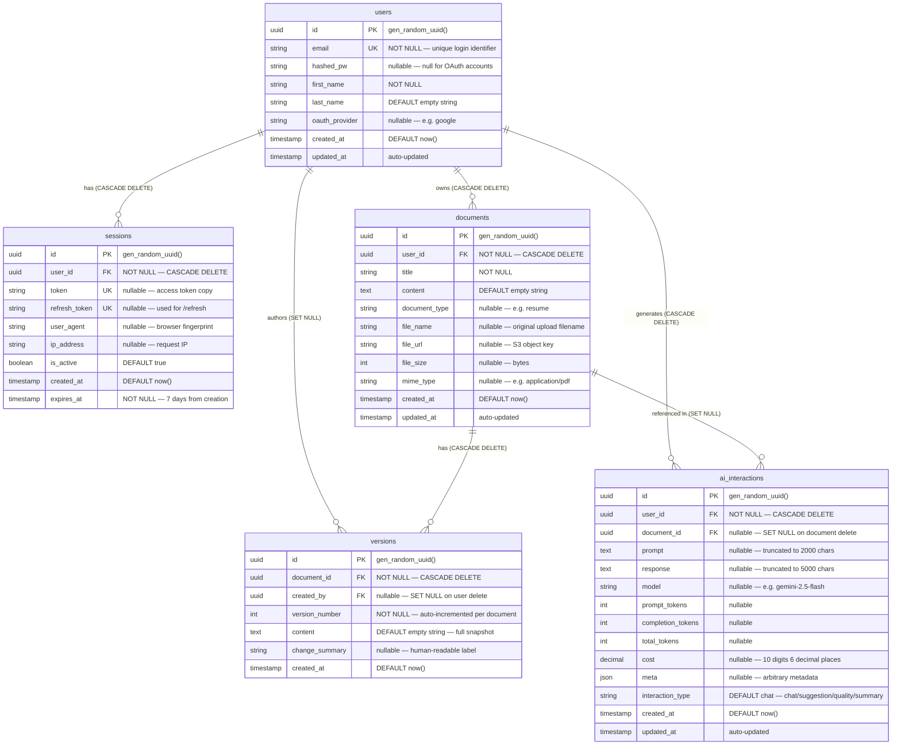

---

## 5. Class Diagrams

### 5.1 Data Model Classes

These classes represent the TypeScript types derived from the Prisma schema. They are the shape of objects flowing between the service and database layers throughout the application.

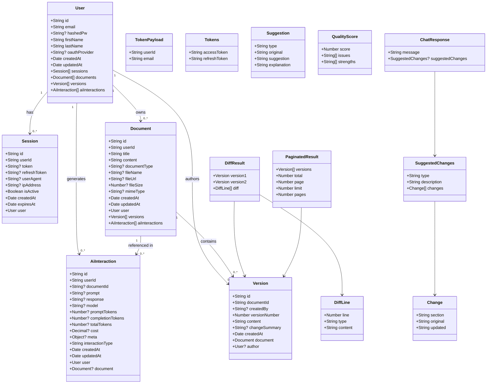

---

### 5.2 Backend Service Layer Classes

The service layer contains all business logic. Each service module is a collection of exported functions (not a class in the OOP sense) but is represented here as a class for clarity. Services call Prisma, the Google AI SDK, the AWS SDK, and utility functions — never each other's HTTP handlers.

```mermaid
classDiagram
    class UserService {
        -PrismaClient prisma
        +createUser(email String, password String, firstName String, lastName String) User
        +findUserByEmail(email String) User|null
        +findUserById(id String) User|null
        +updateUser(id String, data Partial~User~) User
        +changePassword(id String, oldPassword String, newPassword String) void
        +verifyPassword(plain String, hash String) boolean
    }

    class SessionService {
        -PrismaClient prisma
        +createSession(userId String, email String, userAgent String?, ip String?) Tokens
        +findSessionByRefreshToken(token String) Session|null
        +invalidateSession(refreshToken String) void
        +invalidateAllSessions(userId String) void
    }

    class DocumentService {
        -PrismaClient prisma
        -VersionService versionService
        -StorageUtils storage
        +getUserDocuments(userId String) Document[]
        +getDocumentById(id String, userId String) Document
        +createDocument(userId String, data Object, file? File) Document
        +updateDocument(id String, userId String, data Object) Document
        +deleteDocument(id String, userId String) void
    }

    class VersionService {
        -PrismaClient prisma
        +createVersion(documentId String, content String, userId String, summary? String) Version
        +getVersionsByDocument(documentId String) Version[]
        +getPaginatedHistory(documentId String, page Number, limit Number) PaginatedResult
        +getVersionById(versionId String) Version
        +restoreVersion(documentId String, versionId String, userId String) Version
        +compareVersions(versionId1 String, versionId2 String) DiffResult
    }

    class LLMService {
        -String MODEL
        -GoogleGenerativeAI client
        -PrismaClient prisma
        -generate(prompt String, apiKey? String) Object
        +generateSuggestions(content String, documentType String, apiKey? String) Suggestion[]
        +applySuggestions(content String, suggestions Suggestion[]) String
        +summarizeDocument(content String, apiKey? String) String
        +scoreDocumentQuality(content String, documentType String, apiKey? String) QualityScore
        +chatWithDocument(message String, content String, selectedText? String, apiKey? String) ChatResponse
        +logInteraction(userId String, documentId String?, prompt String, response String, tokens Number, type String) void
    }

    class JWTUtils {
        -String JWT_SECRET
        -String JWT_REFRESH_SECRET
        -String JWT_EXPIRES_IN
        -String JWT_REFRESH_EXPIRES_IN
        +signAccessToken(payload TokenPayload) String
        +signRefreshToken(payload TokenPayload) String
        +verifyToken(token String, type String) TokenPayload
    }

    class StorageUtils {
        -S3Client s3Client
        -String S3_BUCKET
        +s3Enabled Boolean
        +uploadFile(buffer Buffer, key String, mimeType String) String
        +deleteFile(key String) void
    }

    class AppError {
        +Number statusCode
        +String message
        +String name
        +AppError(statusCode Number, message String)
    }

    class ErrorHandler {
        +errorHandler(err Error, req Request, res Response, next NextFunction) void
    }

    DocumentService --> VersionService : calls createVersion
    DocumentService --> StorageUtils : uploads / deletes files
    DocumentService ..> AppError : throws
    SessionService --> JWTUtils : signs tokens
    LLMService ..> AppError : propagates
    VersionService ..> AppError : throws 404 / 400
    UserService ..> AppError : throws 409 / 401
    ErrorHandler --> AppError : handles
```

---

### 5.3 Backend Controller Layer Classes

Controllers sit between the HTTP layer and the service layer. They parse and validate request inputs using Zod schemas, call the appropriate service functions, and return JSON responses. They contain no business logic.

```mermaid
classDiagram
    class AuthController {
        -ZodSchema registerSchema
        -ZodSchema loginSchema
        +register(req Request, res Response, next NextFunction) void
        +login(req Request, res Response, next NextFunction) void
        +refresh(req Request, res Response, next NextFunction) void
        +me(req AuthRequest, res Response, next NextFunction) void
        +updateProfile(req AuthRequest, res Response, next NextFunction) void
        +updatePassword(req AuthRequest, res Response, next NextFunction) void
        +logout(req AuthRequest, res Response, next NextFunction) void
    }

    class DocumentController {
        +list(req AuthRequest, res Response, next NextFunction) void
        +get(req AuthRequest, res Response, next NextFunction) void
        +create(req AuthRequest, res Response, next NextFunction) void
        +update(req AuthRequest, res Response, next NextFunction) void
        +remove(req AuthRequest, res Response, next NextFunction) void
    }

    class LLMController {
        -getUserApiKey(req AuthRequest) String|undefined
        +suggestions(req AuthRequest, res Response, next NextFunction) void
        +applyAll(req AuthRequest, res Response, next NextFunction) void
        +summary(req AuthRequest, res Response, next NextFunction) void
        +quality(req AuthRequest, res Response, next NextFunction) void
        +chat(req AuthRequest, res Response, next NextFunction) void
        +updateContent(req AuthRequest, res Response, next NextFunction) void
    }

    class VersionController {
        +list(req AuthRequest, res Response, next NextFunction) void
        +history(req AuthRequest, res Response, next NextFunction) void
        +getOne(req AuthRequest, res Response, next NextFunction) void
        +restore(req AuthRequest, res Response, next NextFunction) void
        +compare(req AuthRequest, res Response, next NextFunction) void
    }

    class RequireAuth {
        +requireAuth(req AuthRequest, res Response, next NextFunction) void
    }

    class AuthRequest {
        +user Object
        +user.id String
        +user.email String
        +user.firstName String
        +user.lastName String
    }

    AuthController --> UserService
    AuthController --> SessionService
    AuthController --> JWTUtils
    DocumentController --> DocumentService
    LLMController --> LLMService
    LLMController --> DocumentService
    VersionController --> VersionService
    RequireAuth --> JWTUtils
    RequireAuth --> PrismaClient
    AuthRequest <|-- Request
```

---

### 5.4 Frontend Component Classes

Frontend components are React functional components represented here as classes showing their props interface and key internal state. The arrows show which components render or depend on each other.

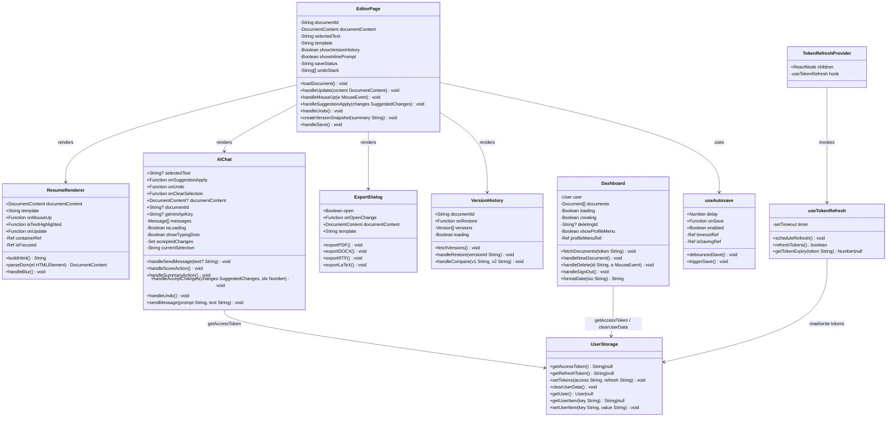

---

## 6. Sequence Diagrams

### 6.1 User Registration and Login

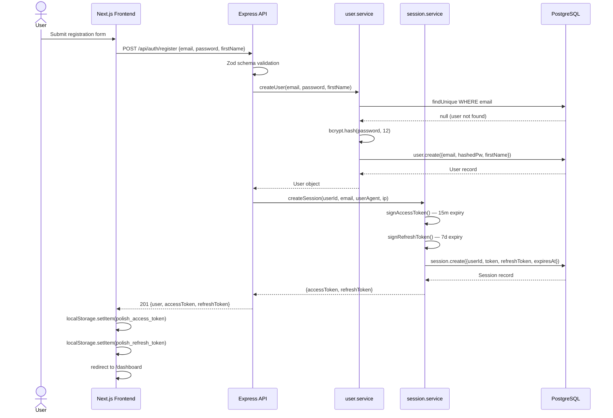

### 6.2 Token Refresh Flow

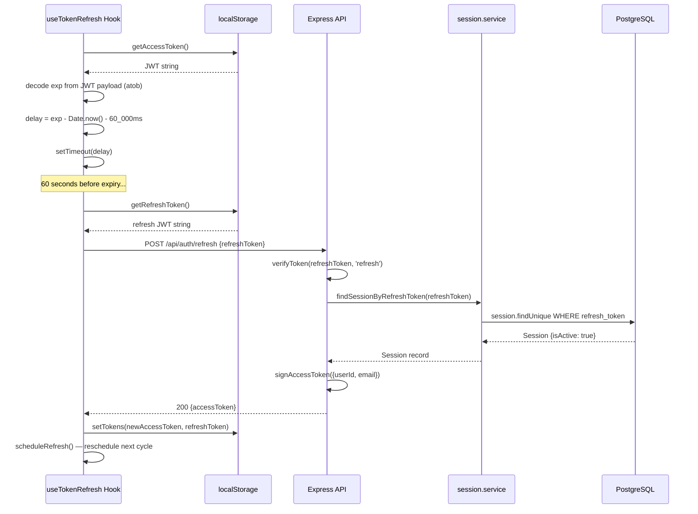

### 6.3 Document Creation with File Upload

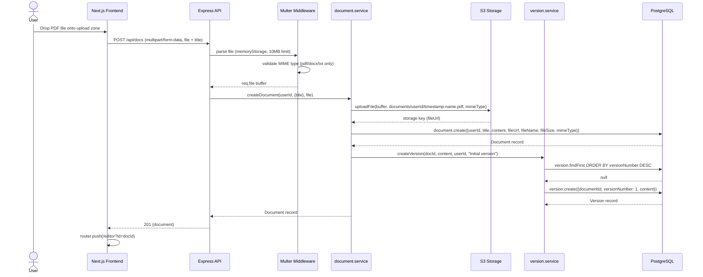

### 6.4 AI Chat Interaction

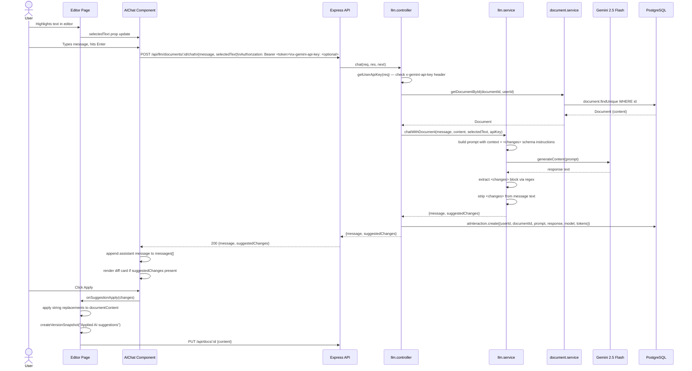

### 6.5 Version Restore Flow

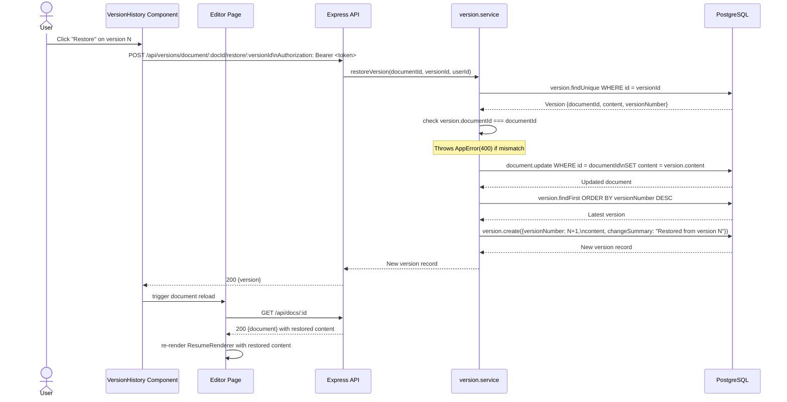

---

## 7. Activity Diagrams

### 7.1 User Authentication Activity

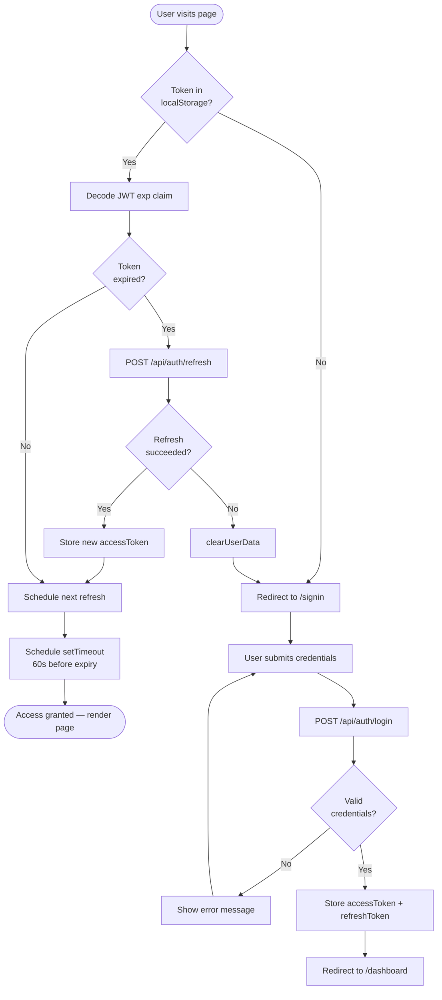

### 7.2 Document Editing and Autosave Activity

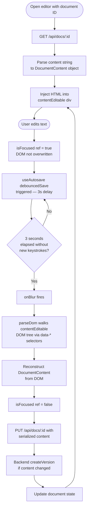

### 7.3 AI Suggestion Application Activity

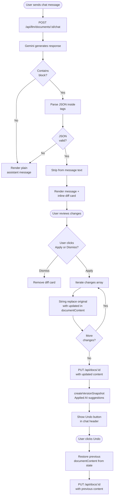

### 7.4 Document Export Activity

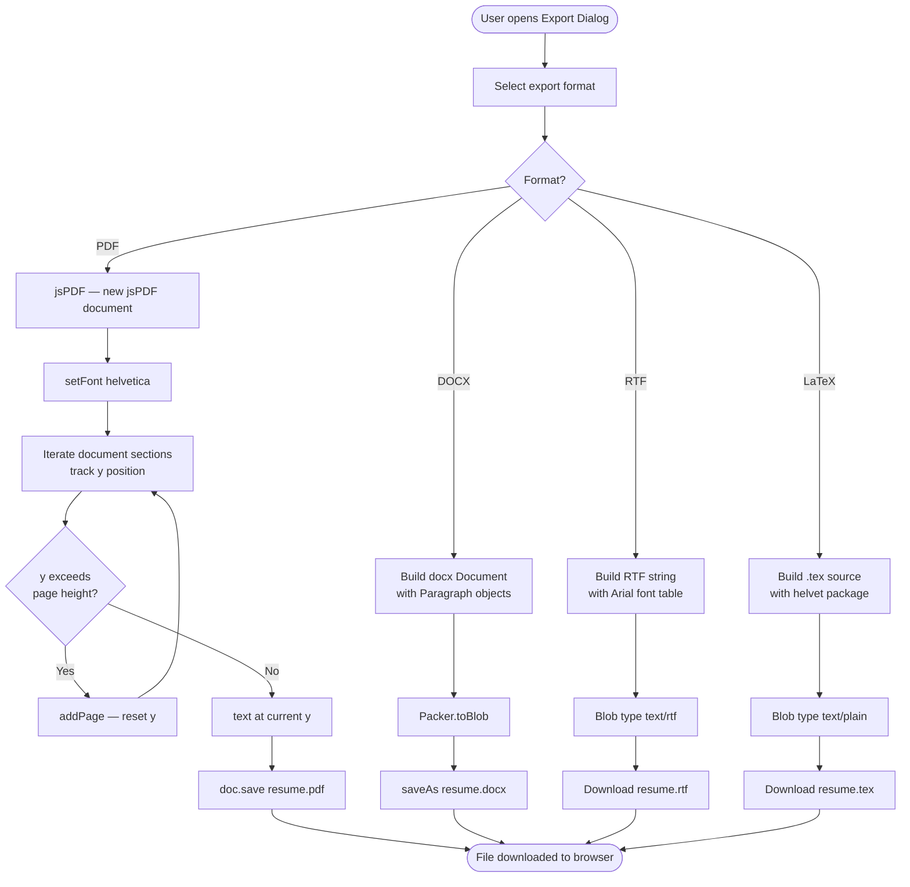

---

## 8. State Diagram — Editor Session

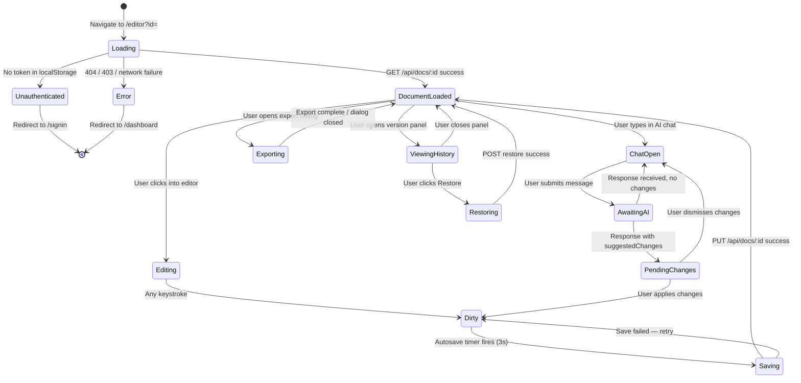

---

## 9. Deployment Architecture Diagram

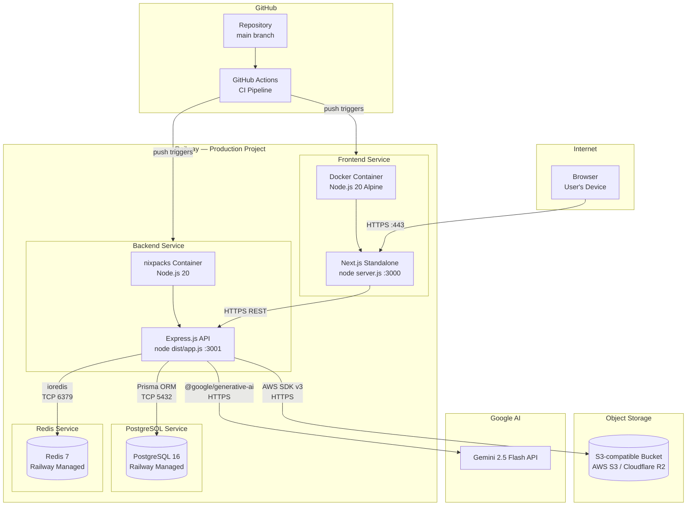

---

## 10. Data Flow Diagram

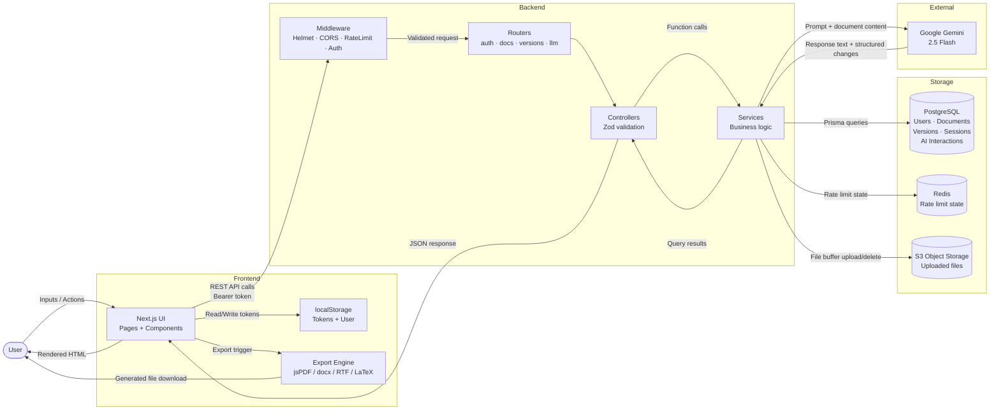
